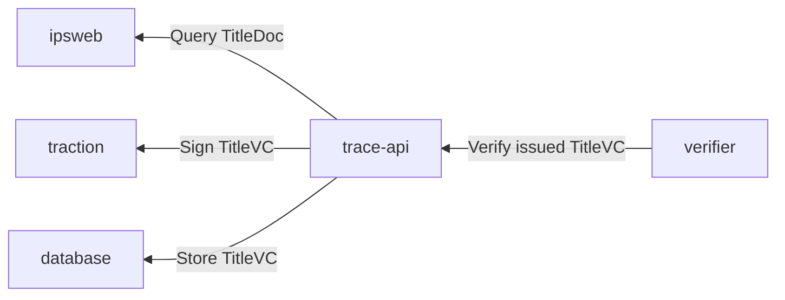
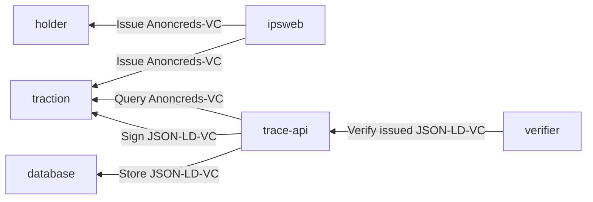

# IPSWEB Traceability API

## Architecture diagrams
### MVP - W3C VC

### with AnonCreds issuance to traction


## From Title Document to Title VC
### Metadata
```html
TITLE NO   :      65960                                           STATUS :  ACTIVE                  
TITLE TYPE : PNG  PETROLEUM AND NATURAL GAS LEASE                 ORIGIN :  DL    63368                                  

ISSUE DATE : 2016-Mar-07         EFFECT DATE : 2016-Mar-07        TERM : 10                             
EXPIRY DATE: 2026-Mar-07
HECTARES   :     288
MAP REF    : 094-B-01 

CANCEL DATE: 
```
```json
{
    "type": ["BCTenureTitle"],
    "validFrom": "2016-Mar-07",
    "issuanceDate": "2016-Mar-07",
    "expirationDate": "2026-Mar-07",
    "credentialSubject": {
        "type": "PetroleumAndNaturalGasLease",
        "identifier": "65960",
        "origin": "DL-63368",
        "term": "10",
        "area": "288",
        "mapRef": ["094-B-01"]
    },
    "credentialStatus": {
        "type": ["BitstringStatusList"],
        "id": "https://vc.traceability.site/status#65960",
        "entry": "65960",
        "statusEndpoint": "https://vc.traceability.site/status",
        "purpose": "cancellation"
    }
}
```
### Ownership
```html
OWNERSHIP
---------
           COMPANY NAME                                            % INTEREST
      -----------------------------------------                    ------------
      CANADIAN NATURAL RESOURCES LIMITED                            50.00000000
      PETRONAS ENERGY CANADA LTD.                                   50.00000000

                                                                   ------------
                                                       TOTAL       100.00000000
                                                                   ------------
```
```json
[
    {
        "type": "Organization",
        "id": "did:web:vc.traceability.site:entity:A0128960",
        "url": "https://orgbook.gov.bc.ca/entity/A0128960",
        "name": "CANADIAN NATURAL RESOURCES LIMITED",
        "interest": "50.00000000"
    },
    {
        "type": "Organization",
        "id": "did:web:vc.traceability.site:entity:A0089569",
        "url": "https://orgbook.gov.bc.ca/entity/A0089569",
        "name": "PETRONAS ENERGY CANADA LTD.",
        "interest": "50.00000000"
    },
]
```
### Caveats

```html
CAVEATS
------
      1     PARCEL LOCATED WITHIN TREATY 8. CONSULTATION MAY BE
            REQUESTED BY A TREATY 8 FIRST NATION.
            

      2     ACCESS AND WELLSITE CONSTRUCTION RESTRICTIONS MAY APPLY
            TO PROTECT:
            

      3     FISH AND WILDLIFE MANAGEMENT RESERVE.
            

      4     POTENTIAL FOR ARCHAEOLOGICAL RESOURCES EXISTS; OVERVIEW
            ASSESSMENT MAY BE REQUIRED.
```

```json
[
    "PARCEL LOCATED WITHIN TREATY 8. CONSULTATION MAY BE REQUESTED BY A TREATY 8 FIRST NATION.",
    "ACCESS AND WELLSITE CONSTRUCTION RESTRICTIONS MAY APPLY TO PROTECT:",
    "FISH AND WILDLIFE MANAGEMENT RESERVE.",
    "POTENTIAL FOR ARCHAEOLOGICAL RESOURCES EXISTS; OVERVIEW ASSESSMENT MAY BE REQUIRED."
]
```
### Tracts
```html
TRACT 1
-----------
		NTS 094-B-09 BLK F UNITS 91
		NTS 094-B-09 BLK G UNITS 100
		NTS 094-B-09 BLK J UNITS 10 56-59 66-69 74-79 84-89
		NTS 094-B-09 BLK K UNITS 1
		
		INCLUDES:    PETROLEUM AND NATURAL GAS
		    DOWN TO BASE OF 42001 CADOMIN-DUNLEVY-NIKANASSIN ZONE 
		
	NOTES : 42001 CADOMIN-DUNLEVY-NIKANASSIN ZONE DEFINED IN THE
	        INTERVAL 3238.4'-4318.2' ON THE GAMMA RAY NEUTRON LOG
	        OF THE WELL W.A. 238 C-53-D/94-B-09
```
```json
{
    "type": "BCTenureTract",
    "locations": [
        "NTS 094-B-09 BLK F UNITS 91",
        "NTS 094-B-09 BLK G UNITS 100",
        "NTS 094-B-09 BLK J UNITS 10 56-59 66-69 74-79 84-89",
        "NTS 094-B-09 BLK K UNITS 1",
    ],
    "rights": {
      "inclusions": [
          {
              "type": "PETROLEUM AND NATURAL GAS",
              "location": "DOWN TO BASE OF 42001 CADOMIN-DUNLEVY-NIKANASSIN ZONE"
          }
      ],
      "exclusions": []
    },
    "notes": [
        "42001 CADOMIN-DUNLEVY-NIKANASSIN ZONE DEFINED IN THE INTERVAL 3238.4'-4318.2' ON THE GAMMA RAY NEUTRON LOG OF THE WELL W.A. 238 C-53-D/94-B-09"
    ]
}
```
### UNTP Schema
```json
{
    "@context": [
        "https://www.w3.org/ns/credentials/v2"
    ],
    "type": [
        "VerifiableCredential",
        "ConformityCredential",
        "BCTenureTitle"
    ],
    "id": "https://ipsweb.traceability.site/titles/65960.jsonld",
    "issuer": {
        "id": "did:web:ipsweb.traceability.site"
    },
    "validFrom": "",
    "issuanceDate": "",
    "expirationDate": "",
    "credentialSubject": {
        "type": "PetroleumAndNaturalGasLease",
        "criteria": "",
        "identifier": "",
        "term": "",
        "area": "",
        "holders": [],
        "tracts": [],
        "caveats": []
    },
    "credentialStatus": {},
}
```
### AnonCreds Schema
```json
{
    "@context": [
        "https://www.w3.org/ns/credentials/v2"
    ],
    "type": [
        "VerifiableCredential"
    ],
    "issuer": "did:web:ipsweb.traceability.site",
    "validFrom": "",
    "credentialSubject": {
        "term": "",
        "area": "",
        "tracts": "",
        "caveats": "",
        "issue_date": "",
        "expiry_date": "",
        "title_type": "",
        "title_number": "",
        "title_holders": "",
        "effective_date": ""
    },
    "credentialStatus": {},
    "proof": [
        {},
        {}
    ]
}
```
